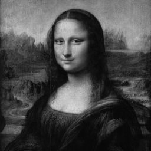
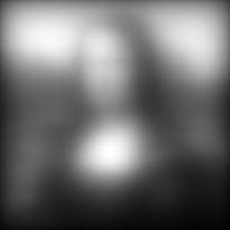

# Image-Deblurring-Project

## Notes of how uses the repository:
1. Clone the repository
2. Install dependencies using `pip install -r requirements.txt` or `conda install --file requirements.txt`
3. If you have Scipy, Numpy, Matplotlib, and OpenCV (for converting images to grayscale and generate matrix requires) installed, you can run the code without installing the dependencies, but it is recommended to install the dependencies to avoid any errors
4. Run the code using `python main.py` or `python3 main.py`
5. You can use any IDE to run the code, instead of using the terminal.
6. The code will generate the deblurred image and display it in a window, and be saved in the same directory as the code, but if you change the images, it will replace the old image with the new one.
7. You can change the image by changing the image path in the code.
8. Project_with_new_images.py will be used to apply the process to the images generated by convertImages.py
9. To get the images for the only example given by the book, run Project.py
10. If you prefer only save images intead of be shown in a window, you can comment the lines plt.show().

### Mona Lisa Images:

 

