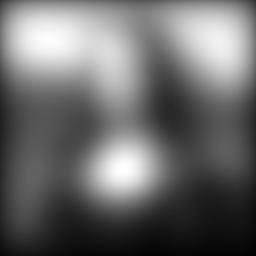
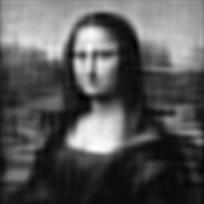

# Image-Deblurring-Project

## Notes of how uses the repository:
1. Clone the repository
2. Install dependencies using `pip install -r requirements.txt` or `conda install --file requirements.txt`
3. If you have Scipy, Numpy, Matplotlib, and OpenCV (for converting images to grayscale and generate matrix requires) installed, you can run the code without installing the dependencies, but it is recommended to install the dependencies to avoid any errors
4. Run the code using `python main.py` or `python3 main.py`
5. You can use any IDE to run the code, instead of using the terminal.
6. The code will generate the deblurred image and display it in a window, and be saved in the same directory as the code, but if you change the images, it will replace the old image with the new one.
7. You can change the image by changing the image path in the code.
8. Project_with_new_images.py will be used to apply the process to the images generated by convertImages.py
9. To get the images for the only example given by the book, run Project.py
10. If you prefer only save images intead of be shown in a window, you can comment the lines plt.show().
11. Adjust the p, alpha,factor, or n values to get different results. Some comments in the code will help you to understand the code.

### Mona Lisa Images:
#### Original Image and Blurred Image:
 

#### Tikhnov Regularization:

#### TSVD:

### Language and libraries used:

- [![Python][python-badge]][python-url] - Python is a popular and versatile programming language known for its readability and beginner-friendliness. It's a general-purpose language used for tasks like web development, data analysis, and automation.  Think of it as a powerful tool with a clear and easy-to-learn instruction set.
- [![Numpy][numpy-badge]][numpy-url] - NumPy is a library for the Python programming language, adding support for large, multi-dimensional arrays and matrices, along with a large collection of high-level mathematical functions to operate on these arrays.
- [![Scipy][scipy-badge]][scipy-url] - SciPy is a free and open-source Python library used for scientific and technical computing. It is a collection of mathematical algorithms and convenience functions built on the NumPy extension of Python.
- [![Matplotlib][matplotlib-badge]][matplotlib-url] - Matplotlib is a plotting library for the Python programming language and its numerical mathematics extension NumPy. It provides an object-oriented API for embedding plots into applications using general-purpose GUI toolkits like Tkinter, wxPython, Qt, or GTK.
- [![OpenCV][opencv-badge]][opencv-url] - OpenCV (Open Source Computer Vision Library) is an open-source computer vision and machine learning software library. OpenCV was built to provide a common infrastructure for computer vision applications and to accelerate the use of machine perception in commercial products.

[python-badge]: https://img.shields.io/badge/Python-FFD43B?style=for-the-badge&logo=python&logoColor=blue
[python-url]: https://www.python.org/
[Numpy-badge]: https://img.shields.io/badge/Numpy-777BB4?style=for-the-badge&logo=numpy&logoColor=white
[Numpy-url]: https://numpy.org/
[Scipy-badge]: https://img.shields.io/badge/Scipy-8CAAE6?style=for-the-badge&logo=scipy&logoColor=white
[Scipy-url]: https://www.scipy.org/
[Matplotlib-badge]: https://custom-icon-badges.demolab.com/badge/Matplotlib-3A75B0?style=for-the-badge&logo=Matplotlib&logoColor=white
[Matplotlib-url]: https://matplotlib.org/
[OpenCV-badge]: https://img.shields.io/badge/OpenCV-5C3EE8?style=for-the-badge&logo=opencv&logoColor=white
[OpenCV-url]: https://opencv.org/
